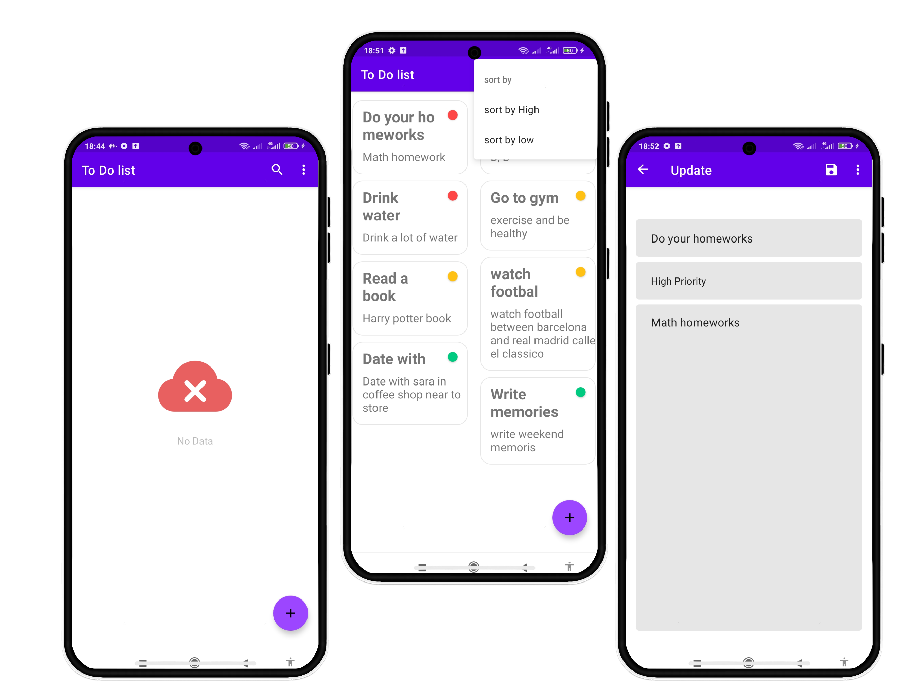

# To-Do App

___
 

 

### App Demo (View Based)

To-Do is a straightforward Android application that assists you in managing your todos efficiently. By employing a
Staggered Grid Layout, this app displays todos with titles, descriptions, and priorities, making it easy for you to stay
organized and on top of your responsibilities. Read through this guide to set up and make the most out of the app.
Features

* Staggered Grid Layout: Visualize todos using a dynamic grid layout that enhances readability.
* Create and Update Tasks: Add new todos and edit existing ones seamlessly.
* Priority-based Sorting: Sort todos based on their priority levels.
* User-Friendly Interface: The app is designed for simplicity and ease of use.

### Prerequisites

Before diving into To-Do, ensure you have the following:

* Android Studio installed on your computer.
* An Android emulator or device .

### Installation

Follow these steps to get To-Do up and running:

* Clone the repository to your local machine:

`git clone <repository_url>`

* Open Android Studio and choose "Open an Existing Project."

* Navigate to the directory where you cloned the project and select it.

### Usage

Here's how you can use To-Do effectively:

* Build and run the app using the Android Studio emulator or a connected Android device.

* Upon launching, you'll be greeted with an intuitive interface.

* To create a new todo, tap the Floating Action Button button. Enter the title, description, and priority level for the
  todo.

* The todos will be displayed in a staggered grid layout. Higher-priority todos will appear at the top.

* To update a todo, tap on the todo card. This will take you to the todo detail screen, where you can modify the title,
  description, or priority.

* To sort todos based on priority, tap the menu icon in toolbar. This will rearrange the todos accordingly.

### Contributing

Your contributions to To-Do are highly appreciated! If you encounter bugs, have suggestions for improvements, or want to
add new features, please feel free to open an issue or submit a pull request. Your efforts will contribute to making the
app even better.

Thank you for choosing To-Do! Simplify your todo management and stay organized effortlessly. Enjoy using the app and
make the most of its features!